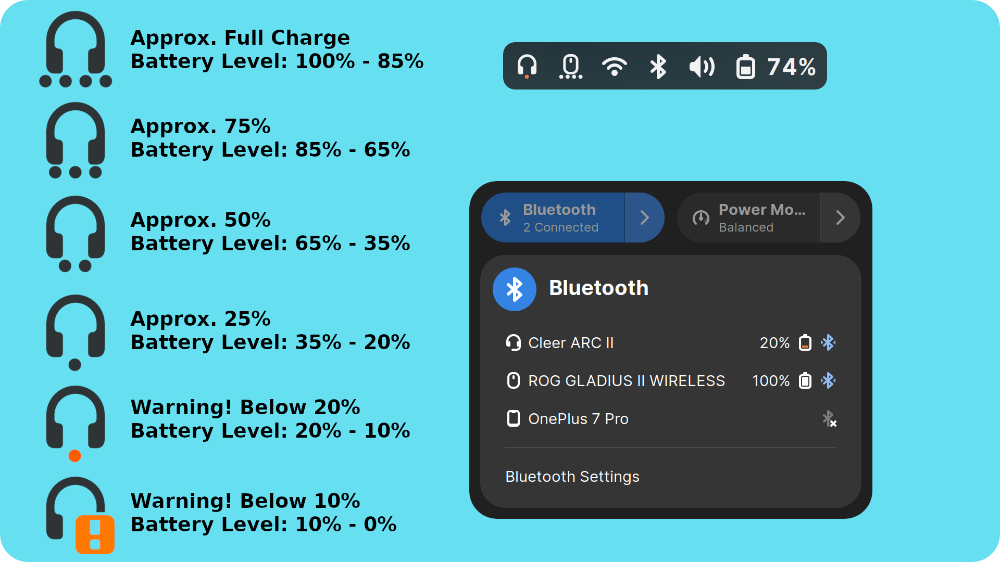
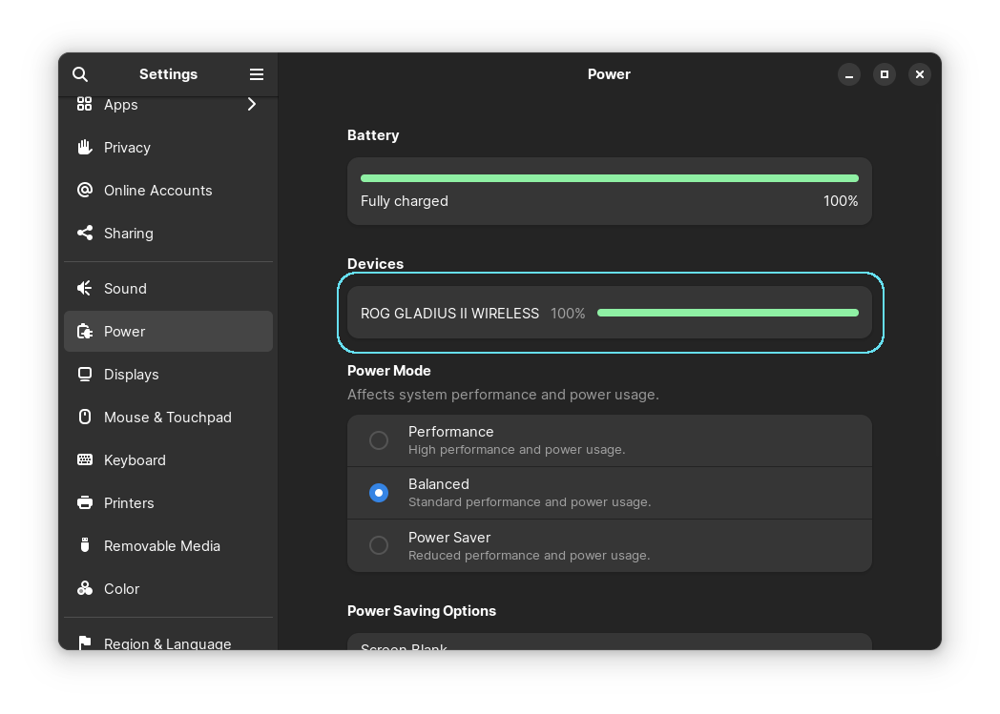
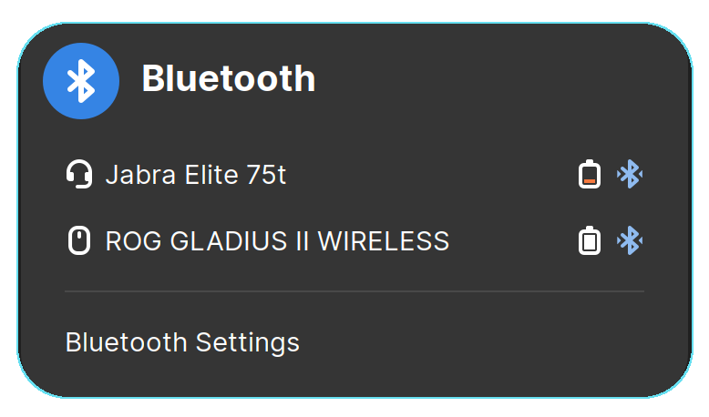
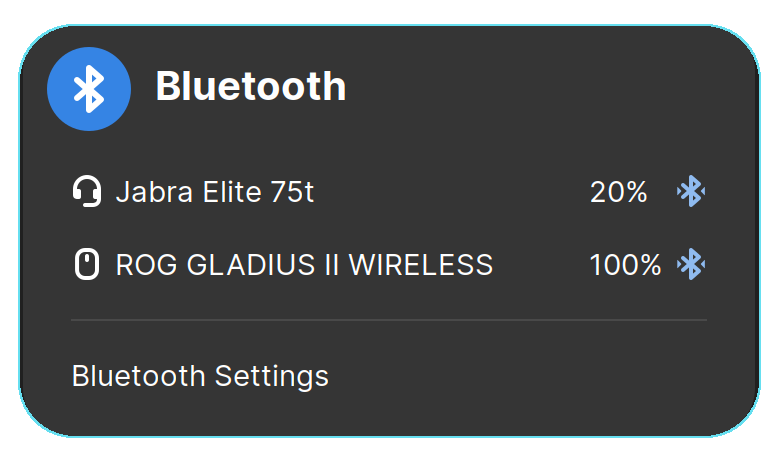
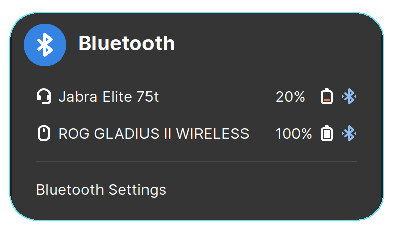
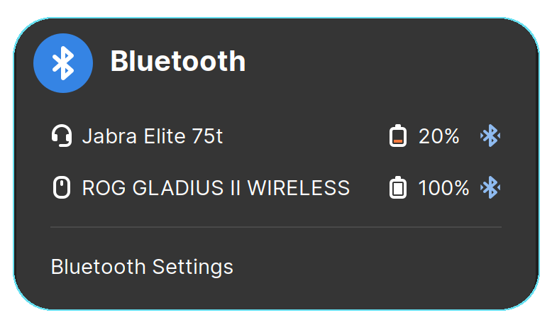
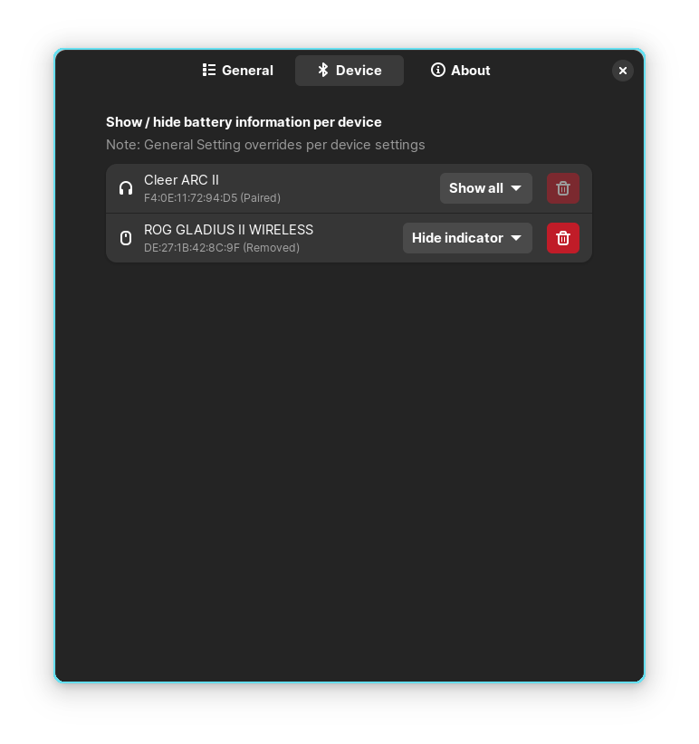

# Bluetooth Battery Meter
[](https://extensions.gnome.org/extension/6670/bluetooth-battery-meter/)
[](https://github.com/maniacx/Bluetooth-Battery-Meter)

{: .important-title }
> Currently supported on Gnome Versions:
> 
> `42, 43, 44, 45`

**Bluetooth Battery Meter is a Gnome Extension featuring indicator icons in system tray, serving as meter for Bluetooth device battery levels and providing detailed battery levels via icon/text in the Bluetooth quick settings menu.**
<br>
<br>



# Important Notes

---

{: .note }
>
> * Certain Bluetooth devices report battery levels in different increments.
> * One would expect a continuous discharge reading like 100, 99, 98, 97... down to 0.
> * However manufacturers often design devices to report in specific increments.
> * Some devices may report battery levels in increments of 5 (e.g., 100, 95, 90, 85... to 0)
> * Some devices may report battery levels in increments of 10 (e.g., 100, 90, 80, 70... to 0)
> * Some devices may report battery levels in increments of 20 (e.g., 100, 80, 60, 40... to 0)
> * For Quick settings percentage displayed in text (when enabled), might observe battery level stuck at a percentage example 100% for a while and later suddenly drop down to 80%, if designed for increment of 20%.

<br>

{: .note }
>
> * Certain Bluetooth devices may not report battery level, and may work only when bluez experimental features are enabled.
> * Most Linux distributions ship with bluez experimental features are disabled, but there are some like Fedora 39 ship with it enabled.
> * If your bluetooth device doesn't show battery level, refer the procedure below to enable bluez experimental feature

# Enable Experimental Bluez

---

If bluetooth device is not reporting battery level, it could be that it needs Bluez Experimental.
Note: Some bluetooth devices may also require to enable Bluez kernel experimental feature.
<br>

### Check if experimental feature
To check if experimental feature is enabled or not by try the following command. It will echo if experimental flag is enabled or disabled.
```bash
bluetoothctl show | grep -q 'PowerState' && echo 'Experimental flag enabled' || echo 'Experimental flag disabled'
```

<br>
### Enable experimental feature
There are several ways to enable experimental feature, the easiest way to enable is to edit system file
```
/etc/bluetooth/main.conf
```
Search for the line `#Experimental = false` and remove the `#` and change from `false` to `true`
```
Experimental = true
```
 Restart the bluetooth service using
```
systemctl restart bluetooth
```
Once done check if device displays battery level under `Power` in `Gnome Control Center (Settings)`
<br>


### Enable kernel experimental feature
Users have reported that some devices will not report battery level until the **kernel experimatal** flag is enabled. If the battery level is still not reported. Try to enable bluez kernel experimental feaures
Edit system file
```
/etc/bluetooth/main.conf
```
Search for the line `#KernelExperimental = false` and remove the `#` and change from `false` to `true`
```
KernelExperimental = true
```
 Restart the system.

# Features

---

## **Battery Level vs Icon**

| Icon Meter Level | Battery Level |
|:-:|:-:|
|  | Approx. Fully Charge<br>Battery level: 100 - 85%  |
|  | Approx. 75%<br>Battery level: 85-65% |
|  | Approx. 50%<br>Battery level: 65-35% |
|  | Approx. 25%<br>Battery level: 35-20% |
|  | Warning! Below 20%<br>Battery level: 20-10% |
|  | Warning! Below 10%<br>Battery level: 10-0%|

---

## **Supported Device Type and Icon**

| Icons Types | Reported by BT Client |
|:-:|:-:|
|  | <b>input-mouse</b> |
|  | <b>input-keyboard</b> |
|  | <b>input-gaming</b> |
|  | <b>input-tablet</b> |
|  | <b>audio-headphone</b> |
|  | <b>audio-headset</b> |
|  | <b>audio-speakers</b> |

---

## **System Tray Indicators**
This extension provide information by displaying battery Levels of Bluetooth device as a Meter. This help taking minimum space on the system panel without being very intrusive.
<br>
These indicator icon can also be disabled in Extension Preferences
<br>
<br>
**Extension Preferences**
<br>

<br>
<br>
**System Tray Indicators**
<br>


---

## **Display Battery Level Icon In Bluetooth Quick Settings Menu**
An option to add/remove Battery Level icon in Bluetooth quick settings menu. 
<br>
<br>
**Extension Preferences**
<br>

<br>
<br>
**Bluetooth Quick Settings**
<br>


---

## **Display Battery Percentage In Text In Bluetooth Quick Settings Menu**
An option to add/remove Battery Percentage in text in Bluetooth quick settings menu. 
<br>
<br>
**Extension Preferences**
<br>

<br>
<br>
**Bluetooth Quick Settings**
<br>


---

## **Swap Battery Percentage Text With Icon In Bluetooth Quick Settings Menu**
When both, Battery Percentage Text and Battery Level Icon are enabled, Setting this feature to enabled with display Text after Icon, and vice versa
<br>
<br>
**Extension Preferences**
<br>

<br>
<br>
**Bluetooth Quick Settings Icon Before Text Disabled**
<br>

<br>
<br>
**Bluetooth Quick Settings Icon Before Text Enabled**
<br>

<br>
<br>

## **Bluetooth Indicator Show Percentage in text**
Display battery percentage in text next to the indicator icon. 
<br>

<br>
<br>

<br>
<br>

## **Per Device Settings**

* Users have the option to disable the display of battery levels in the quick settings and the indicator. This is particularly useful if an unsupported Bluetooth device (not yet supported by BlueZ) reports incorrect battery levels, allowing users to hide it from the quick settings and the indicator.
* Additionally, users can opt to disable the indicator if they prefer not to show a Bluetooth device's indicator icon in the system tray.

### Settings Description
* **Enable All**: Display the battery level in both quick settings and the indicator.
* **Disable All**: Hide the battery level in both quick settings and the indicator.
* **Hide Indicator**: Do not display an indicator for the Bluetooth device, but show the battery information in quick settings.

When a Bluetooth device capable of reporting its battery level is detected, it is automatically added to the preferences, and the setting is saved in GSettings. This ensures that the user does not need to configure per-device settings again when the device reconnects.

A Bluetooth device can only be deleted from the device preference page when it is unpaired. If the user no longer wishes to connect the Bluetooth device in the future, it can be removed from this list.

